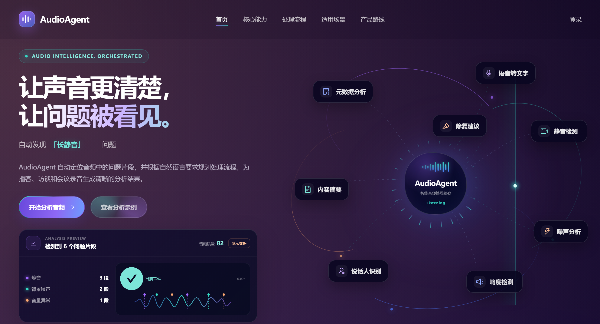
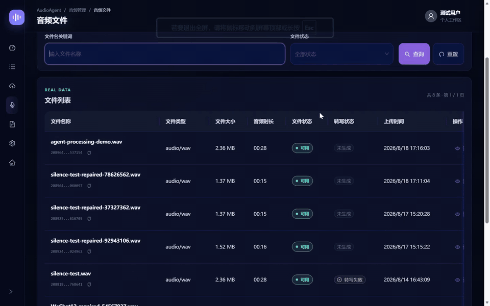
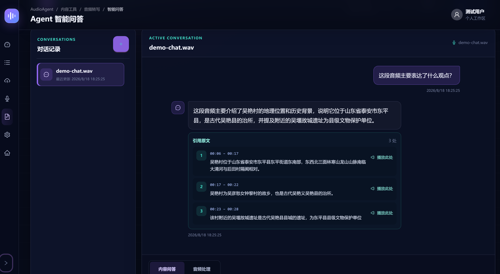
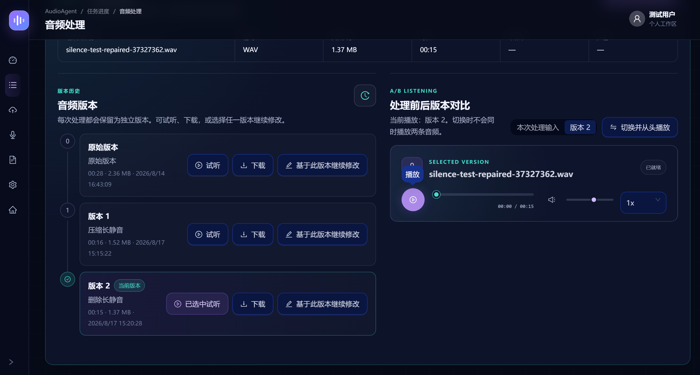
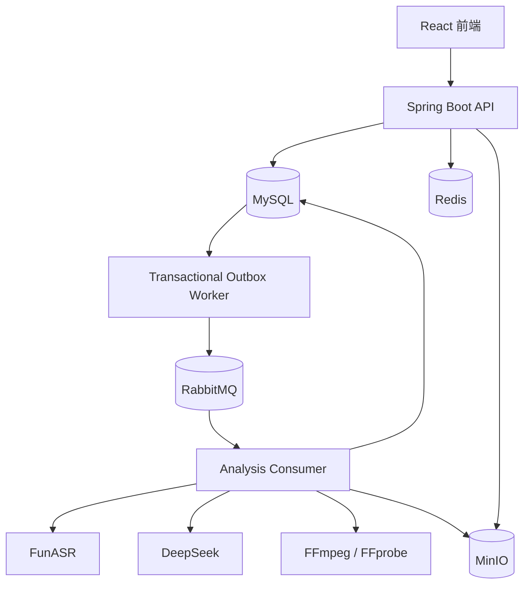
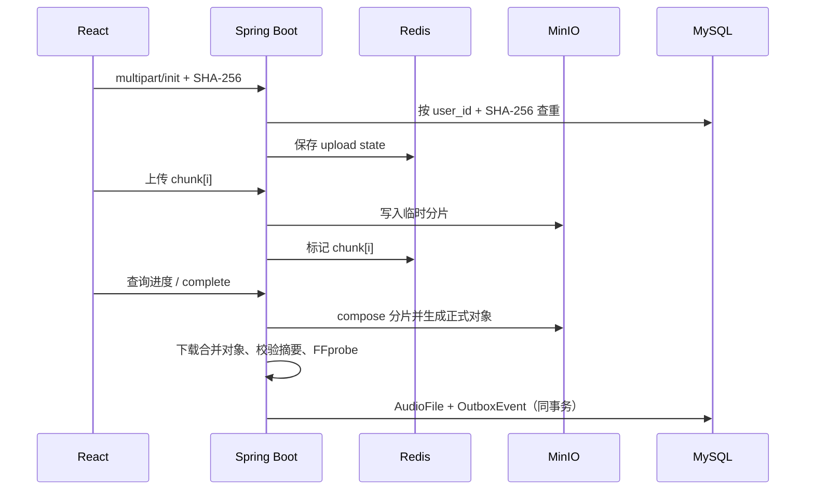
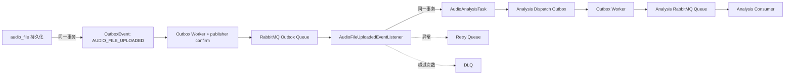
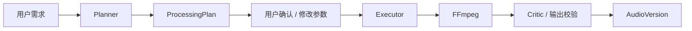
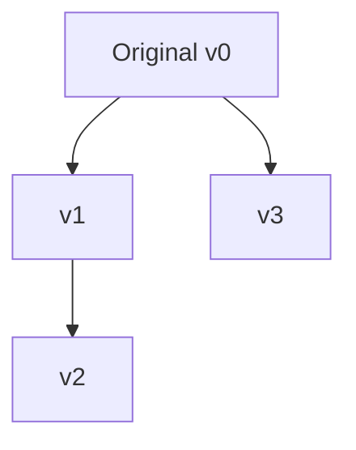

# Audio Agent

> 面向长音频的智能分析与处理平台：从上传、解析、分析到 Agent 驱动的音频处理与版本管理。

**分片上传与断点恢复** · **音频质量分析** · **Agent 处理方案** · **FFmpeg 音频处理** · **非破坏式版本管理**

## 项目简介

Audio Agent 面向需要处理长音频的用户，将以下流程串成一条可追踪流水线：

```text
上传音频 → 音频解析 → 转写 / 内容分析 / 质量诊断
        → Agent 理解处理需求 → 生成处理方案 → 用户确认
        → FFmpeg 执行 → 结果校验 → 生成新的音频版本
```

项目以音频为核心，当前没有视频处理业务说明。

## 项目展示

以下内容来自项目实际运行效果。

### 产品首页



展示 Audio Agent 产品首页与核心音频分析能力。

### Agent 智能处理



用户通过自然语言描述处理需求，系统生成方案，经确认后执行音频处理并生成新的非破坏式版本。

### Agent 智能问答



基于音频转写内容进行问答，支持引用原文、时间定位和点击播放。

### 音频版本管理



每次处理生成独立版本，不覆盖原始文件，支持历史版本试听、下载、继续修改以及 A/B 对比。
架构图继续使用下方 Mermaid，不额外制作或引用架构图片。

## 核心功能

- **分片上传**：初始化、分片进度查询、重复分片幂等、MinIO 临时分片合并。
- **断点恢复式续传**：中断后查询 Redis 已上传分片并补传。当前没有独立 `pause` / `resume` API 或 `PAUSED` 状态；客户端暂停是停止发送，继续时补传缺失分片。
- **完整性与去重**：按当前用户和 SHA-256 查重；合并后重新校验文件大小和 SHA-256。
- **音频分析**：FFprobe 元数据解析，以及静音、响度、音量变化、噪声风险和质量报告。
- **转写与内容分析**：FunASR 转写，DeepSeek 基于转写片段做内容分析。
- **Agent 处理**：Planner 生成方案，用户确认后 Executor 调用 FFmpeg，Critic 校验结果。
- **音频处理步骤**：`NORMALIZE_VOLUME`、`TRIM_SEGMENT`、`DENOISE`、`SILENCE_CLEANUP`（`COMPRESS` / `REMOVE`）。
- **版本管理与隔离**：原始音频不被覆盖；Sa-Token 会话认证配合服务层 ownership 隔离。

## 系统架构



API 负责校验和事务写入；耗时分析、转写、内容分析和处理由消费者执行。RabbitMQ 发布使用 publisher confirm，消费者手动 ACK。

## 核心业务流程

### 上传与分析



默认分片 8 MB，允许 5–10 MB；上传状态和分片集合在 Redis 中带 TTL。完成阶段使用用户+hash 合并锁；数据库写入失败会补偿删除已发布的 MinIO 对象。

### 音频分析与处理

上传完成后，系统先创建分析任务；分析消费者从 MinIO 获取音频，使用 FFprobe、FFmpeg 音频分析器和配置的阈值生成结果与报告。处理 Agent 可以直接基于 `AudioFile` 和已完成分析工作，不依赖 transcript。

## 关键技术设计

### MQ / Outbox 可靠性



数据库 commit 后直接发 MQ 可能出现“库成功、消息丢失”；先发 MQ 又可能读到未提交数据。因此业务事务内写 Outbox，Worker 扫描投递。confirm 超时、NACK、return 和发送异常会重试；超过次数为 `FAILED`，支持人工恢复。第一层 listener 创建分析任务时，再在同一事务写 `AUDIO_ANALYSIS_TASK_CREATED` Outbox，形成第二层可靠派发。

消费者采用至少一次投递：`source_event_id` 防止同一上传事件重复创建分析任务；`SUCCESS` 重投直接 ACK；`PROCESSING` 通过 lease、CAS、execution token 和 fencing 防止旧消费者回写新 owner 的任务。

### Consumer 状态机

```text
PENDING → PROCESSING → SUCCESS
                    ↘ FAILED
```

`PROCESSING` 超过 lease 后可恢复；恢复通过 CAS 匹配状态、旧时间和旧 token。execution token 用于 claim、续租、进度和终态更新。

## Agent 工作流



Planner 只输出结构化白名单操作和参数，不输出 shell 命令；Executor 只执行已确认计划；Critic 校验执行状态、输出文件、大小、时长和摘要。

`CHAT` 面向已有转写上下文的问答和引用定位；`PROCESSING` 面向音频处理计划。两者都使用 Agent 能力，但上下文和目标不同。

## 音频版本管理



`root_audio_file_id` 指向版本树根；`source_file_id` 指向直接输入；`version_no` 表示 root 内版本号；`source_execution_id` 记录产生版本的执行。数据库有 `source_execution_id` 唯一约束和 `(root_audio_file_id, version_no)` 联合唯一约束。这样可以保留原始证据、支持 A/B 对比和失败隔离。

## 技术栈

| 层次 | 技术 | 职责 |
| --- | --- | --- |
| 后端 | Spring Boot 3、MyBatis-Plus | API、事务、任务状态机和业务编排 |
| 前端 | React、TypeScript、Vite、Ant Design | 上传、轮询、报告、方案确认和版本展示 |
| 数据库 | MySQL | 业务状态、结果、Outbox 和版本关系 |
| 缓存 | Redis | 分片状态、TTL、已上传集合和合并锁 |
| 消息队列 | RabbitMQ | Outbox 投递、任务、retry queue、DLQ |
| 对象存储 | MinIO | 临时分片、合并对象和正式音频 |
| AI | FunASR、DeepSeek | 转写、内容分析和方案生成 |
| 音频处理 | FFmpeg、FFprobe | 解析、分析、处理和输出校验 |

## 项目运行

准备 MySQL、Redis、RabbitMQ、MinIO、FunASR、FFmpeg/FFprobe，再启动 Spring Boot 后端和 React 前端。`infra/docker-compose.yml` 当前只包含 Redis、MinIO；本次文档调整不启动 Docker、不修改真实数据库。

敏感配置、后端/前端启动命令和本地依赖说明统一见 [`docs/development.md`](docs/development.md)。文档只列环境变量名，不包含密码、Token 或 API Key。

核心业务链路覆盖单元测试与集成测试，包括 Outbox 事务、消息消费幂等、用户资源隔离及音频处理 Pipeline 等场景。
